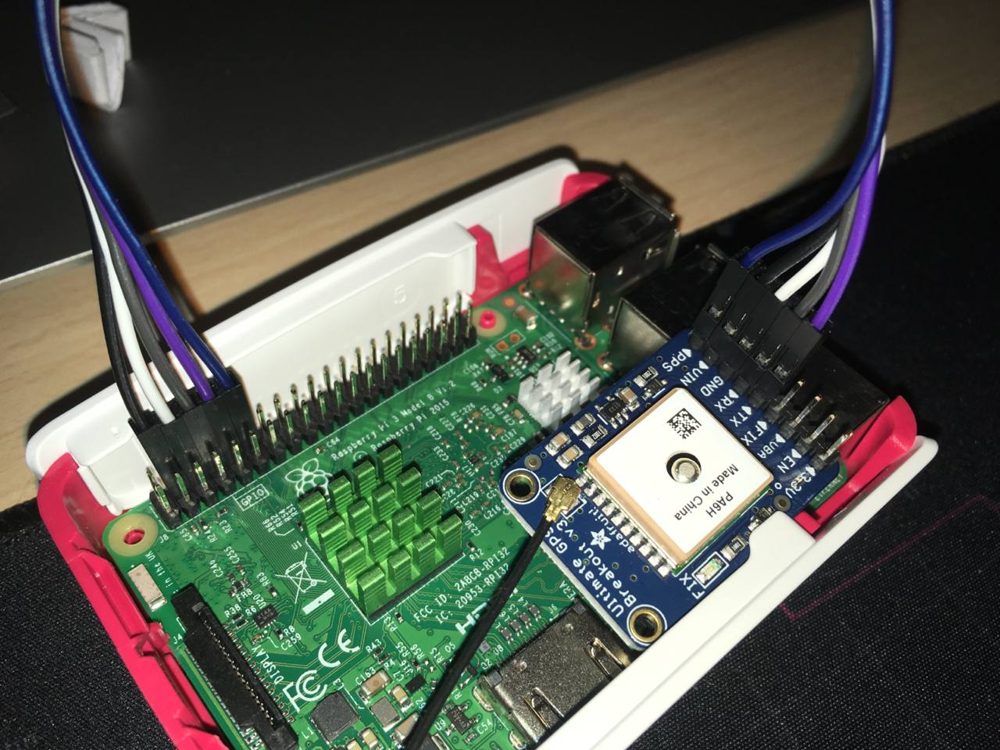

## Connection

### R-Pi diagram


| Physical | GPIO   | Description |
| -------- | ------ | ----------- |
| 1        |        | 3.3V        |
| 4        |        | 5V          |
| 6        |        | Ground      |
| 8        | GPIO14 | TX          |
| 10       | GPIO15 | RX          |
| 12       | GPIO18 | PCM_CKL     |

### Adafruit

[Detailed information](https://learn.adafruit.com/adafruit-ultimate-gps/pinouts)

- **VIN** - power input, connect to 3-5VDC. It's important to connect to a clean and quiet power supply. GPS's are very sensitive, so you want a nice and quiet power supply. Don't connect to a switching supply if you can avoid it, an LDO will be less noisy!
- **GND** - power and signal ground. Connect to your power supply and microcontroller ground.
- **TX** - the pin that transmits data from the GPS module to your microcontroller or computer. It is 3.3V logic level. Data comes out at **9600 baud** by default
- **RX** - the pin that you can use to send data to the GPS. You can use use 3.3V or 5V logic, there is a logic level shifter. By default it expects **9600 baud** data, and remember you need to send it checksum'med NMEA sentences
- **PPS** is a new pin output on V3 modules. Its a "pulse per second" output. Most of the time it is at logic low (ground) and then it pulses high (3.3V) once a second, for 50-100ms, so it should be easy for a microcontroller to sync up to it

#### Connection diagram



| Physical RPi Pin | Adafruit |
| ---------------- | -------- |
| 4 | VIN |
| 6 | GND |
| 8 | RX |
| 10 | TX |
| 12 | PPS |

### uBlox


## Prepare the Pi

> First of all, disable serial terminal using `dietpi-config` and also set the `Time sync mode` to `Custom` in `Advanced` section.

Update the system and install some packages:

```bash
apt update
apt upgrade
apt install -y pps-tools gpsd gpsd-clients python-gps chrony
```

Edit the file `/boot/config.txt` with these lines:

```conf
# the next 3 lines are for GPS PPS signals
dtoverlay=pps-gpio,gpiopin=18
enable_uart=1
init_uart_baud=9600
```

And enable the kernel module pps:

```bash
echo 'pps-gpio' >> /etc/modules
```

Configure the GPSD service ([gpsd(8)](https://gpsd.gitlab.io/gpsd/gpsd.html)):

```conf
cat << EOF > /etc/default/gpsd

# Default settings for the gpsd init script and the hotplug wrapper.
# Start the gpsd daemon automatically at boot time
START_DAEMON="true"

# Use USB hotplugging to add new USB devices automatically to the daemon
USBAUTO="true"

# Devices gpsd should collect to at boot time.
# They need to be read/writeable, either by user gpsd or the group dialout.
DEVICES="/dev/ttyS0 /dev/pps0"

# Other options you want to pass to gpsd
GPSD_OPTIONS="-n"
EOF
```

> See more gpsd options [here](http://manpages.ubuntu.com/manpages/trusty/man8/gpsd.8.html)

Shutdown the system, connect the gps device and check that PPS is loaded with `lsmod | grep pps` and it works `ppstest /dev/pps0`. If everything works, it is time to configure chrony.

```conf
cat << EOF > /etc/chrony/chrony.conf
# Welcome to the chrony configuration file. See chrony.conf(5) for more
# information about usuable directives.

# delay determined experimentally by setting noselect then monitoring for a few hours
# 0.325 means the NMEA time sentence arrives 325 milliseconds after the PPS pulse
# the delay adjusts it forward
# refclock SHM 0 delay 0.325 offset 0.5 refid GPS noselect << working?
#refclock SHM 0 offset 0.4 refid GPS noselect

# refclock SHM 0 delay 0.325 refid GPS noselect
# refclock PPS /dev/pps0 lock GPS refid GPPS
refclock SHM 0  refid GPS delay 0.0 offset 0.176 no select
refclock PPS /dev/pps0 lock GPS refid GPPS

#refclock PPS /dev/pps0 lock GPS refid GPPS

pool ntp.i2t.ehu.eus iburst noselect
pool 0.es.pool.ntp.org minpoll 4 maxpoll 6 polltarget 16 noselect

# This directive specify the location of the file containing ID/key pairs for
# NTP authentication.
keyfile /etc/chrony/chrony.keys

# This directive specify the file into which chronyd will store the rate
# information.
driftfile /var/lib/chrony/chrony.drift

# Uncomment the following line to turn logging on.
#log tracking measurements statistics

# Log files location.
logdir /var/log/chrony

# Stop bad estimates upsetting machine clock.
maxupdateskew 100.0

# This directive enables kernel synchronisation (every 11 minutes) of the
# real-time clock. Note that it can’t be used along with the 'rtcfile' directive.
rtcsync

allow 0.0.0.0/24
local stratum 10

# Step the system clock instead of slewing it if the adjustment is larger than
# one second, but only in the first three clock updates.
makestep 0.1 3
EOF
```

> **offset**
> This option can be used to compensate for a constant error. The specified offset (in seconds) is applied to all samples produced by the reference clock. The default is 0.0.

Adjust the offset value to keep down the offset of GPS0 below `+/-200ms`

> **delay**
> This option sets the NTP delay of the source (in seconds). Half of this value is included in the maximum assumed error which is used in the source selection algorithm. Increasing the delay is useful to avoid having no majority in the source selection or to make it prefer other sources. The default is 1e-9 (1 nanosecond).

Start chrony and enable it to automatically start on boot.

```bash
systemctl daemon-reload
systemctl restart chrony
systemctl enable chrony
```

### Remove DHCP hook

To prevent the Pi from getting NTP configuration from any DHCP servers, remove `ntp-servers` from the end of the request block in the `/etc/dhcp/dhclient.conf` file:

```diff
request subnet-mask, broadcast-address, time-offset, routers,
        domain-name, domain-name-servers, domain-search, host-name,
        dhcp6.name-servers, dhcp6.domain-search, dhcp6.fqdn, dhcp6.sntp-servers,
        netbios-name-servers, netbios-scope, interface-mtu,
-       rfc3442-classless-static-routes, ntp-servers;
+       rfc3442-classless-static-routes;
```

## Monitoring with telegraf

sudo apt-get install apt-transport-https

### Install telegraf

```bash
wget -qO- https://repos.influxdata.com/influxdb.key | sudo apt-key add -
source /etc/os-release
test $VERSION_ID = "7" && echo "deb https://repos.influxdata.com/debian wheezy stable" | sudo tee /etc/apt/sources.list.d/influxdb.list
test $VERSION_ID = "8" && echo "deb https://repos.influxdata.com/debian jessie stable" | sudo tee /etc/apt/sources.list.d/influxdb.list
test $VERSION_ID = "9" && echo "deb https://repos.influxdata.com/debian stretch stable" | sudo tee /etc/apt/sources.list.d/influxdb.list
test $VERSION_ID = "10" && echo "deb https://repos.influxdata.com/debian buster stable" | sudo tee /etc/apt/sources.list.d/influxdb.list

apt-get update && sudo apt-get install telegraf
service telegraf start
```

### Configure telegraf

To configure telegraf to collect metrics from chrony and GPSD, add the following configuration:

```conf
# Get standard chrony metrics, requires chronyc executable.
[[inputs.chrony]]
  ## If true, chronyc tries to perform a DNS lookup for the time server.
  dns_lookup = false
[[inputs.exec]]
  commands = ['/bin/bash -c "gpspipe -w -n 10 127.0.0.1:2947 | grep lat | head -n 1"']
  timeout = "5s"
  data_format = "json"
  json_string_fields = ["status", "lat", "lon", "alt"]
  tag_keys = ["class", "device"]
```

> Put this into `/etc/telegraf/telegraf.conf` or modify telegraf's service `/lib/systemd/system/telegraf.service` to run with `--config` : `ExecStart=/usr/bin/telegraf --config url`

## Useful commands

- `chronyc clients`: to see connected clients to chrony
- `gpspipe -w -n 10 127.0.0.1:2947`: to get `gpsd` messages
- `chronyc sources -v`
- `chronyc sourcestats -v`
- `gpsmon`
- `cgps`
- `gpspipe -ru | grep --line-buffered GGA | cut -b 20-26`

## Documentation

Some links:

- https://austinsnerdythings.com/2021/04/19/microsecond-accurate-ntp-with-a-raspberry-pi-and-pps-gps/
- https://github.com/patricktokeeffe/rpi-ntp-server
- http://manpages.ubuntu.com/manpages/bionic/man1/chronyc.1.html
- https://chrony-users.chrony.tuxfamily.narkive.com/THLqaerf/trouble-with-pps#post10
- https://chrony.tuxfamily.org/doc/3.4/chrony.conf.html
- http://www.theory.physics.ubc.ca/chrony2016-10-15/chrony.html
- https://engineering.fb.com/2020/03/18/production-engineering/ntp-service/
- http://www.unixwiz.net/techtips/raspberry-pi3-gps-time.html
- https://gpsd.gitlab.io/gpsd/gpsd-time-service-howto.html
- https://github.com/beta-tester/RPi-GPS-PPS-StratumOne
- [Stratum 1 Basque Country](https://support.ntp.org/bin/view/Servers/PublicTimeServer000463)

> > But PPS by itself can't provide datetime, only second synchronization. What would happen if I don't let chrony select GPS clock? Would it know what time is it?
>
> That's what the lock option is for. It allows a refclock to provide another refclock with seconds, but otherwise be ignored for synchronization.

> > PPS signal comes from the same device as GPS data, so their distance shouldn't ever vary, right?
>
> This is about the NTP distance. It is the maximum assumed error of the source. If the delay of the GPS messages is slowly changing over time (which is not uncommon), the offset between the two sources will be changing. If you don't increase the distance, you might get two sources that don't agree with each other (their error intervals don't overlap) and chronyd wouldn't which one should be trusted.

> So how do we calculate the drift? The general idea is simple. Measure the time offset every N seconds over a longer window of time T, plot the graph, and fit a straight line. The slope of that line is the drift. The units cancel out. Parts-per-million is a handy scale.

> The easiest way to determine the offset with chronyd is probably to configure the source whose offset should be measured with the noselect option and a long poll, let chronyd run for at least 4 hours and observe the offset reported in the chronyc sourcestats output. If the offset is unstable, wait longer. F
